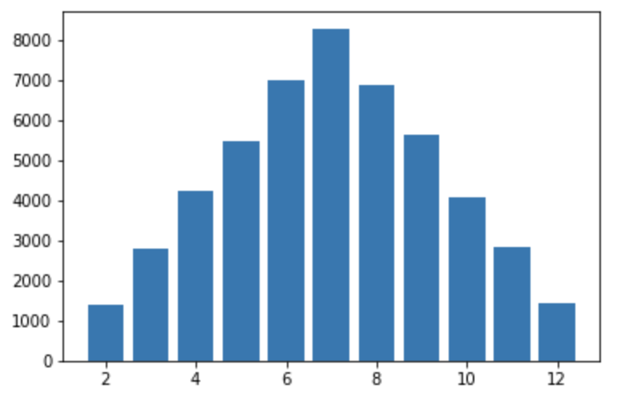
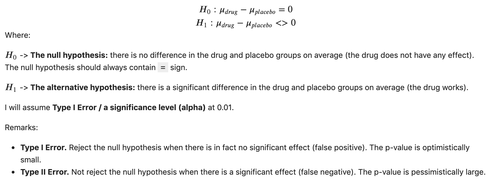
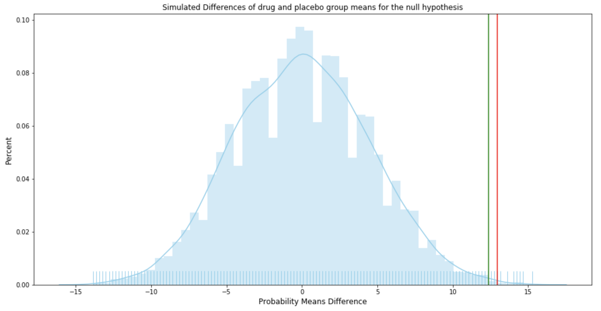

# A Gentle Introduction to Computational Statistics

## Overview
There are two perspectives we can look at statistical problems while solving them: analytical and computational.

**Analytical methods** are based on mathematics (mainly statistics and probability) and use of domain and theoretical knowledge. **Computational methods** are based on computer science (mainly software engineering) and use of fundamental computing techniques, like looping or random number generator.

Analytical methods were in many cases the only ones practically available in the past as data collection and computing power were expensive. Nowadays, computational methods become more and more attractive as data collection and computing gets cheaper and more easily available than before.

The main analytical tools are statistical tests and probability whereas computational approach is based on simulations.

In this paper, I will walk you through two examplary problems (simulating outcomes and permutation testing) and compare how they can be solved using both methods.

## Example 1: Simulating Outcomes

This example shows how we can do an efficient simulation of probabilities of common events and statistics.

Let's try to answer the following question using both methods: **If you roll two 6-sided dice, how likely is it that the sum of results is greater than 7?**

### Analytical Method

First, let's answer with the **analytical method**. The problem type above is variations with repetition. We have 6 to the power of 2 possible outcomes, 36 pairs in total. A pair (x, y) would consist of two numbers, x being a rolling result of the first die and y being a rolling result of the second one.

Our results would look like like these: (1, 1), (1, 2), (1, 3), ..., (6, 6) but we are interested in the ones where the sum of pair elements is greater than 7. Let's enumerate only the pair matching our requirement:

- (2, 6) -> 1
- (3, 5), (3, 6) -> 2
- (4, 4), (4, 5), (4, 6) -> 3
- (5, 3), ..., (5, 6) -> 4
- (6, 2), ..., (6, 6) -> 5

There are 15 pairs where the sum of elements is greater than 7. We can calculate the likelihood of getting the sum of results as:

\<number of pairs with the sum greater than 7> / \<number of all possible pairs> = 15/36 = 0.4166(6)

**The answer is:** There is 42% of likelihood that if we roll two 6-sided dice we get the sum of the results greater than 7.

The example above is simple to solve analitically as the number of variations is reasonable small (36) but what if our problem was more complex? For example, how we could solve analitically the following question: **If you roll seven 6-sided dice, how likely is it that the sum of results is greater than 35?** In this case we would have 6 to the power of 7 possible outcomes, which is 279,936 variations of pairs. Solving this problem analitically would take us plenty of time...

### Computational Method

Here is how we could answer the same question (**If you roll two 6-sided dice, how likely is it that the sum of results is greater than 7?**) with a simulation.

We will use `choices()` function from `random` module and `Counter` class from `collections` module.

```python
from random import choices
from collections import Counter
```
Then we define our die.

```python
# Define a 6-sided die
faces = list(range(1, 7))
faces

[1, 2, 3, 4, 5, 6]
```
We will use `choices()` function to simulate a dice roll. The function takes our die definition as the first argument, and `k` defines a number of dice. If we only wanted we could also apply different weights to die faces. But not this time.

```python
# A function for rolling a pair of dice
roll_2_dice = (lambda: choices(population=faces, weights=None, k=2))
pair = roll_2_dice()
pair

[6, 5]
```
We can sum a pair of result using the `sum()` function.

```python
sum(pair)

11
```
Now, the main part begins. We repeat the step described above 50,000 times and save the sums in the `rolls` list.

```python
# Simulate rolling a pair many times and tracking the outcomes
rolls = [sum(roll_2_dice()) for _ in range(50_000)]
```
We can use `Counter` class to return a dictionary, where the dictionary keys are sum values and the dictionary values are number of pairs with the same value of sum as the dictionary key.

```python
# Count those outcomes (number of sums of paired elements)
rolls_counts = Counter(rolls)
print(rolls_counts)

Counter({7: 8293, 6: 6987, 8: 6878, 9: 5646, 5: 5465, 4: 4252, 10: 4058, 11: 2832, 3: 2781, 12: 1417, 2: 1391})
```
As a bonus, using the technique below, we can sort the dictionary by keys or values in both ascending and descending order. This would be difficult to achieve with an analytical approach.

```python
# Sort by faces [0] or counts [1] and store the sorted results as a dictionary
rolls_counts = dict(sorted(rolls_counts.items(), key=lambda x: x[1], reverse=True))
print(rolls_counts)

{7: 8293, 6: 6987, 8: 6878, 9: 5646, 5: 5465, 4: 4252, 10: 4058, 11: 2832, 3: 2781, 12: 1417, 2: 1391}
```
Another thing we can do easily with the computational approach is results visualization.

```python
# Plot the outcome of simulating many dice rolling (Binomial Distribution)
import matplotlib.pyplot as plt
%matplotlib inline

labels, values = zip(*rolls_counts.items()) # Unpack dict
plt.bar(x=labels, height=values);
```

<center></center>


Now, we are ready to answer our question. The code below sums the number of occurences of sums greater than 7 and divides it by all occurences.

```python
# If you roll two dice, how likely is it that your sum is greater than 7
sums_above_7 = sum(v for k, v in rolls_counts.items() if k > 7)
all_sums = sum(rolls_counts.values())

likelihood = sums_above_7 / all_sums
likelihood

0.41662
```
The result is at the same time the likelihood that if we roll two 6-sided dice we get the sum of the results greater than 7. Of course, the result we got using computational method (42%) matches the one derived from the analytical method (42%).

### Analytical vs. Computational

To summarize, here are the steps of the two approaches:

- Analytical approach
	- Think about all possible outcomes
	- Enumerate outcomes which meet the condition (>7)
	- Count the outcomes which meet the condition and calculate the likelihood

- Computational approach
	- Define 6-sided die
	- Simulate rolling a pair of dice (many times)
	- Count and calculate the likelihood
	- Bonus: count, sort, visualize easily

Solving the problem analytically, we would have a problem with the more complex scenario (7 dice, sum greater than 35) whereas computationally we can solve it right away. The working code and the complex case solution can be found the Jupyter notebook linked below.

**Example 1: Simulating Outcomes** ([Jupyter](https://github.com/ksatola/Computational-Statistics/blob/master/Example1.ipynb), [HTML](https://ksatola.github.io/projects/ComputationalStatisticsExample1.html))

## Example 2: Permutation Testing

In this example **we would like to know if a drug is effective or not**. This is a classic A/B testing problem which we solve in analytical and computational way.

The first and common to both methods step is to describe the problem mathematically and define a few inputs to our analysis. For this, we will use a standard hypothesis testing approach, defining our null and alternative hypotheses as follows:

<center></center>

For the above, I will assume a significance level (alpha) of 0.01. The significance level is the threshold for rejecting a difference between the groups.

In simple words, to confirm if the drug works, we need to find out if there is a statistically significant difference between the two groups of patients. We will be comparing means of the group results (samples) to see if they significantly differ or not.

We represent our groups as lists where each number is a result of patient's examination. In our case we do not know what the numbers means and if the higher number represents the better result or not. That is why two-tailed alternative hypothesis is chosen - we just want to confirm if the two groups differ significantly.

 The treatment group is where patients get the drug and the control group is where patients do not get the drug (only a kind of mockup/not working replacement).

```python
import numpy as np

# treatment group
drug = [54, 73, 53, 70, 73, 68, 52, 65, 65] 

# control group
placebo = [54, 51, 58, 44, 55, 52, 42, 47, 58, 46] 

# Significance level
alpha = 0.01
```

For our groups, we observe the means difference of 12.97 but the question is if this difference is statistically significant and the drug works? Is the difference only between the two samples (drug and placebo) or we could infere that this would be also valid for the entire patients population?

```python
# Means difference of the samples
np.mean(drug) - np.mean(placebo)

12.966666666666661
```

### Analytical Method

First, let's try to answer to this question analytically. For that we will use T-Student sampling distribution and calculate t-test statistic. Statistical tests usually come with some assumptions, and t-test is not an exception.

T-test assumptions:

1. Both groups (drug and placebo) should be normally distributed.
2. Samples should come from populations with equal variances.
3. Samples should be of the same size.
4. At best there should be more than 20 observations in a sample.

Assumtions 3 and 4 are quick to deal with. Our first sample (drug) has 9 observations and the second (placebo) 10. They are not equal in size but close, so we can live with it. The small number of observations (less than 20) may impact the quality of t-test outcome but we have no other choice but to try (we do not have any other observations).

To check if assumption one is is met we will use Shapiro-Wilk test designed specifically for samples containing less than 50 observations. For that we will use a helper function `normaltest()` which utilizes `shapiro()` function of the `scipy.stats` module.

```python
from scipy import stats

def normaltest(sample, name, alpha=0.05):
    '''
    Shapiro-Wilk test for samples with n < 50 observations.
    Reference: https://docs.scipy.org/doc/scipy/reference/generated/scipy.stats.shapiro.html
    '''
    W, p = stats.shapiro(sample)
    #print("W = {:g}".format(W))
    #print("p = {:g}".format(p))
    if p < alpha:  # null hypothesis: sample comes from a normal distribution
        print("{} does not come from a normal distribution".format(name))
    else:
        print("{} comes from a normal distribution".format(name))
```

Let's now test if our first assumption is true regarding the drug and placebo samples.

```python
# Is drug normally distributed?
normaltest(drug, "Drug")

Drug comes from a normal distribution
```

```python
# Is placebo normally distributed?
normaltest(placebo, "Placebo")

Placebo comes from a normal distribution
```

Our samples come from a normal distribution, although it is difficult to say that by just looking at data because we have only 9 and 10 observations.

Now it is time to deal with the second assumtion, stating that our samples should come from populations with equal variances. It is important to mention that we are not checking variances of the samples (their variances are not equal) but if they come from populations with equal variances. 

To check if the second assumption is valid, we will use `varsequals()` helper function utilizing `bartlett()` function from `scipy.stats` module. The function uses Bartlett's test which answers the question if our samples come from populations with equal variances.

```python
def varsequals(sample1, sample2, alpha=0.01):
    '''
    Perform Bartlett’s test for equal variances.
    Bartlett’s test tests the null hypothesis that all input samples are from populations with equal variances.
    Reference: https://docs.scipy.org/doc/scipy-0.14.0/reference/generated/scipy.stats.bartlett.html
    ''' 
    T, p = stats.bartlett(sample1, sample2)
    #print("T = {:g}".format(T))
    #print("p = {:g}".format(p))
    if p < alpha:  # null hypothesis: all input samples are from populations with equal variances
        print("Not all input samples are from populations with equal variances.")
    else:
        print("All input samples are from populations with equal variances.")
```
It seems that our second assumption is also valid.

```python
varsequals(drug, placebo)

All input samples are from populations with equal variances.
```

Now, we can perform our test and check if the mean difference of our two samples is statistically significant. The remaining question is if our samples are expected to have been drawn from the same population. To do this, we will do a t-test using `ttest_ind()` function from `scipy.stats` module.

```python
# We assume all observations are independent
t_stat, p = stats.ttest_ind(drug, placebo) 
print('t={:.4f}, p={:.4f}'.format(t_stat, p))

t=3.9357, p=0.0011
```

The t-test statistic value is 3.9357 and our p-value is 0.0011. The p-value is a probability of obtaining a result equal to or more extreme than was observed in the data. If our p-value (0.0011) is less than our alpha (0.01) than we can reject our null hypothesis (that there is no difference between drug and placebo) and assume the alternative hypothesis that the drug is effective.

```python
# Interpret via p-value
if p < alpha:
    print('Reject the null hypothesis that the means are equal.')
else:
    print('Accept null hypothesis that the means are equal.')
    
Reject the null hypothesis that the means are equal.
```

We can also confirm our finding calculating degrees of freedom,

```python
# Calculate degrees of freedom
df = len(drug) + len(placebo) - 2
df

17
```

and a critical value.

```python
# Calculate the critical value (two-tailed test)
# PPF (percent point function)
cv = stats.t.ppf(1.0 - alpha/2, df)
cv

2.8982305196347173
```
Using the critical value and t-test statistic we infer the same as above. Our drug works.

```python
# Interpret via critical value (abs for symmetric distribution)
if abs(t_stat) <= cv:
    print('Accept null hypothesis that the means are equal.')
else:
    print('Reject the null hypothesis that the means are equal.')
    
Reject the null hypothesis that the means are equal.
```
To summarize the analytical approach, we proved that we have sufficient evidence to reject the null hypothesis which means that the drug works.

### Computational Method

Now it is time to check if the drug is effective in a computational way. We will be using our hypothesis definition but instead of doing a statistical test and satisfying its assumption we assume the null hypothesis is true, so there is no difference in the groups.

To refresh, the observed mean difference in drug and placebo groups is 12.97 (observed_diff).


```python
observed_diff = mean(drug) - mean(placebo)
print(f"{observed_diff:.2f}")

12.97
```

If there is no difference in means of the treatment and control groups, we can merge the observations from both groups and then check how likely is that the observed_diff value or greater appears. We will now simulate the mean differences doing random groups assignment from the common pool (drug and placebo combined) many times.

```python
from statistics import mean
from random import shuffle

# Unite the data
combined = drug + placebo

n = 10_000
count = 0
simulated_means = []

# Simulate it a bunch of times
for _ in range(n):
	 # Rearrange in-place
    shuffle(combined)
    
    # Split combined into simulated drug and placebo grups
    # and calculate a simulated mean difference
    shuffled_diff = mean(combined[:len(drug)]) - mean(combined[len(drug):])
    
    # Add the difference for future reference
    simulated_means.append(shuffled_diff)
    
    # Increase counter if the simulated mean difference
    # is equal or greater from the observed mean difference
    count += (shuffled_diff >= observed_diff)
```
If the null hypothesis is true (the drug does not work, on average group means are close to 0) we should observe many occurences of mean differences equal or greater to observed_diff. If not, then we can safely reject the null hypothesis (as the observed_diff would be exceptional for samples drawn from the same distribution).

Our simulation result shows that 12 times on 10,000 simulated mean difference was equal or greater then observed one. According to our logic, if such difference was common we would get the difference at least 12.97 many more times.

```python
print(f"""{n:,} label reshufflings produced only {count} instances 
with a difference at least as extreme as the observed difference of {observed_diff:.2f}.""")

10,000 label reshufflings produced only 12 instances 
with a difference at least as extreme as the observed difference of 12.97.
```
We can also calculate a p-value easily. To recall, p-value is a chance of observing the current difference when there is truly no difference. In other words it is a probability of obtaining a result equal to or more extreme than was observed in the data.

```python
p = count / n
p

0.0012
```
The p-value is only 0.0012 and is far less than our significance level (alpha) established at 0.01 level.

```python
# Interpret via p-value
if p < alpha:
    print('Reject the null hypothesis that the means are equal.')
else:
    print('Accept null hypothesis that the means are equal.')
    
Reject the null hypothesis that the means are equal.
```
One of the nice "side effects" of computational approach is that doing simulations we gather data we can use to interpret our result visually.

```python
# Find the quantile for the alpha/2 cutoff (two-tailed test)
cv = np.max(simulated_means) - stats.t.ppf(1.0 - alpha/2, df)

simulated_means = np.asarray(simulated_means)
plt.figure(figsize=(16, 8))
sns.distplot(simulated_means, color="skyblue", kde=True, hist=True, rug="True")
plt.title("Simulated Differences of drug and placebo group means for the null hypothesis", fontsize=12)
plt.xlabel("Probability Means Difference", fontsize=12)
plt.ylabel("Percent", fontsize=12)

# Critical value
plt.axvline(cv, color='g');

# Observed mean difference
plt.axvline(observed_diff, color='r'); 
```

<center></center>

The picture above shows our simulated distribution of mean difference. The green vertical line represents the critical value and the red one the mean difference observed between drug and placebo groups. We clearly see that it is very unlikely that drug and placebo samples come from the same distribution (red line).

To summarize the computational approach, we can say that it we have sufficient evidence to reject the null hypothesis, and we conclude that the drug is effective.


### Analytical vs. Computational

The analytical and computational approaches are in general very similar except the core part (in bold below):

- Analytical approach
	- Setup testing framework.
		- Define null and alternative hypothesis.
		- Set alpha (the threshold for rejecting differences).
	-  Collect data.
	-  **Pick a sampling distribution, calculate a test statistic, remember about assumptions.**
	-  Calculate p-value.
	-  Draw conclusion.

- Computational approach
	- Setup testing framework.
		- Define null and alternative hypothesis.
		- Set alpha (the threshold for rejecting differences).
	- Collect data.
	- **Iterate while shuffling data to simulate null effect and createa sampling distribution.**
	- Calculate p-value.
	- Draw conclusion.

To conclude, analytical method often dictates the test statistic, and tests have assumptions we must meet. This is not the case while simulating. In addition, if we have issues like censored data, non-independence, or long-tailed distributions, we may not find an off-the-shelf test. In such a case, unless we are mathematical statisticians, we may not be able to make a suitable statistical test by ourselves. Computational approach seems to be more easy to comprehend and to execute.
 
You can find a complete working code in Jupyter notebook format below.

**Example 2: Permutation Testing** ([Jupyter](https://github.com/ksatola/Computational-Statistics/blob/master/Example2.ipynb), [HTML](https://ksatola.github.io/projects/ComputationalStatisticsExample2.html))

## Additional Resources

- [ComputationalStatistics-master.zip](https://github.com/ksatola/Computational-Statistics/blob/master/ComputationalStatistics-master.zip) - a copy of [Brian Spiering](https://github.com/brianspiering/ComputationalStatistics) repo. Brian's talk during [DSCO19](https://www.sfdatainstitute.org/) in San Francisco was a trigger for me to start dealing more systhematically with computational statistics.
- [analytical\_vs\_computational.pdf](https://github.com/ksatola/Computational-Statistics/blob/master/analytical_vs_computational.pdf) - a few slides with a context and brief summary of analytical and computational methods.
